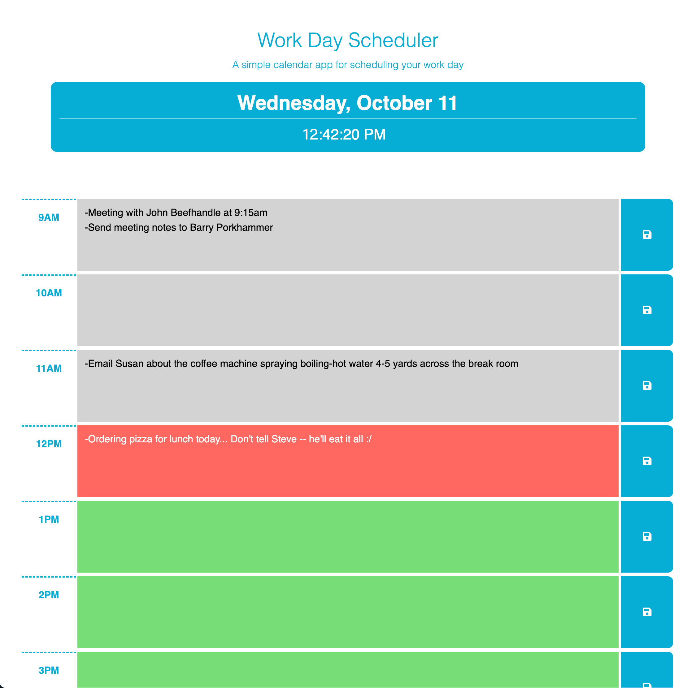

# Work Day Planner

## Description

This project is a simple work day planner:

- This planner was created as a lightweight tool for quickly mapping out a daily schedule.
- With this planner, users can have a space to plan their day, take notes, or jot down reminders without having to jump through hurdles like logging into an app or pulling out a notes app on your phone.

This was a fun project to tackle, and throughout development I was able to hone my skills with jQuery and day.js.

## Usage

### [Start planning your day by clicking this link](https://abealberts.github.io/work-day-scheduler/)

#### Features:
- Date and time that update in real time
- Automatic color-coding (past, present, future) on hour blocks
- Save user data for each hour block individually via the save buttons

#### Screenshot:

(yo Steve gotta stop eating all the pizza for real)